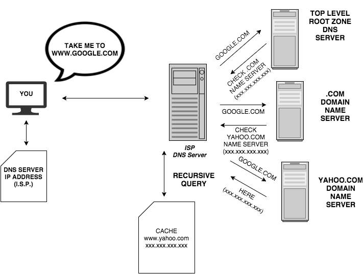
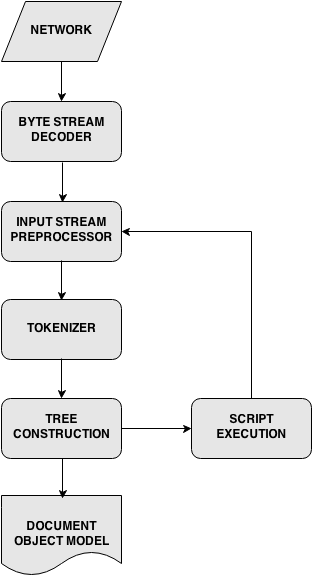

## 浏览器基本知识学习

全局认知:

- DNS查询
- 页面请求发送
- ~~请求认证~~请求拆分
- HTML渲染
- DOM树构建
- Render树构建
- Render树布局
- 绘制

### DNS查询

DNS服务的主要任务是讲我们地址栏输入的域名`http://www.google.com`转换成计算机更容易理解的`ip`地址。

DNS查询根据查询优先级有以下的流程:

> 浏览器缓存 -- > OS缓存 -- > 本地网络设备DNS缓存 -- > ISPDNS查询 ... -- > 最顶级DNS服务器查询

其中任何一步中,如果有查询到对象的目标就不会进行下一步的查询。



dns查询的基本流程如上,如果我们资源存在多个cdn服务器来承载,可能会在资源加载过程中有对多域名地址有查询的消耗,可以通过**nds-prefetch**来实现dns的预先缓存,优化查询时间。


dns查询需要的额外带宽几乎可以忽略,然而却可能带来很高的延迟,这在移动网络中更是表现的更加明显,所以对dns的预先缓存很有必要:

> <meta http-equiv="x-dns-prefetch-control" content="off" >

> <link rel="dns-prefetch" href="http://www.google.com" >

> <link rel="dns-prefetch" href="//www.google.com" >

### 页面请求发送


### Parse Render Layout Paint过程


1. 页面的成型首先是对HTML的构建过程:



这个过程最主要的目的很集中,就是将我们的HTML文档变成DOM文档。

```html
<html>
<body>
<p>Hello World</p>
<div></div>
</body>
</html>
```


2. Render构建

> DOM tree + CSS == Render tree
> CSS Box Model

这里我们需要提到的一点是:只有可见的元素才会出现在Render树中,例如`head`, `display: none, position: absolute, position: relative`等不会出现在Render树中。


3. Render树布局

布局过程中主要的实现的事情就是对元素*position, size*的计算。

4. Render绘制

[](./render-layout.mp4)


